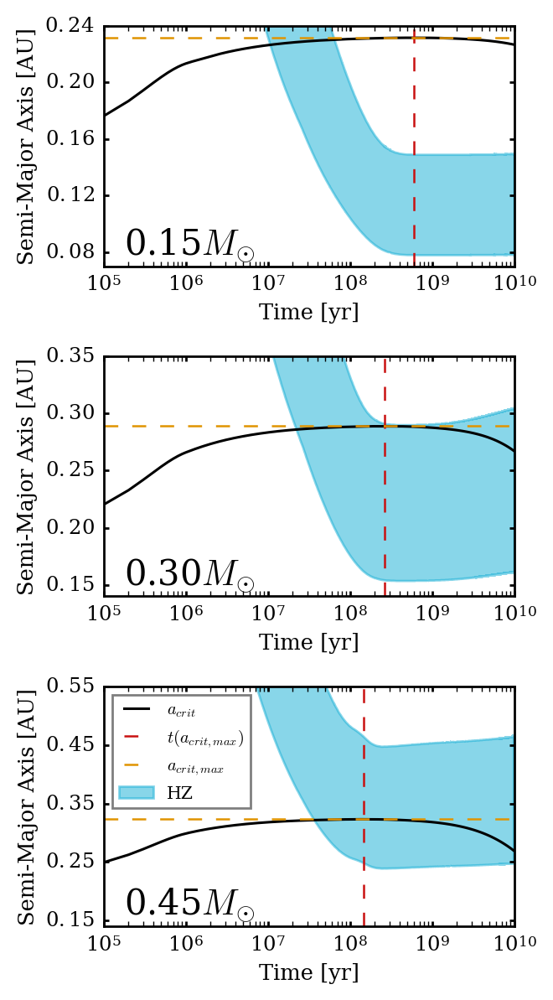

Time Evolution of the Habitable Zone of equal-mass Binary Stars.
=====

Overview
-----

We combine the obtained expression of the critical semi-major axis from 
`Holman & Wiegert (1999) <https://ui.adsabs.harvard.edu/abs/1999AJ....117..621H/abstract>`_ 
and overlapped them with the habitable zone limits from 
`Kopparapu (2013) <https://ui.adsabs.harvard.edu/abs/2013ApJ...765..131K/abstract>`_
where the inner limit of the HZ is the runaway greenhouse effect and the outer limit is the
maximum greenhouse effect. We run through the time evolution of the critical semi-major axis
along with the computed habitable zone limits in order to observe how dynamic stability limits
affect the habitable of binary stars.

===================   ============
**Date**              01/14/19
**Author**            David Graham
**Modules**           eqtide stellar
**Approx. runtime**   6 min total
===================   ============
 
Running the script.
----

In each ``StellarMass`` folder, run the following:

.. code-block:: bash

    vplanet vpl.in

Then in the ``STEEP_CTL`` folder run:  

.. code-block:: bash

    python makeplot.py <pdf | png>

Expected image
-----

   Modeling equal-mass binary stars with 0.15 (top), 0.30, and 0.45 solar masses respectively.
   Knowing the maximum critical semi-major axis helps us see how the dynamic stability limit 
   could have affected cbp's that once could have orbited around the habitable zone and may
   have gone unstable due to the early effects of the critcal semi-major axis.

