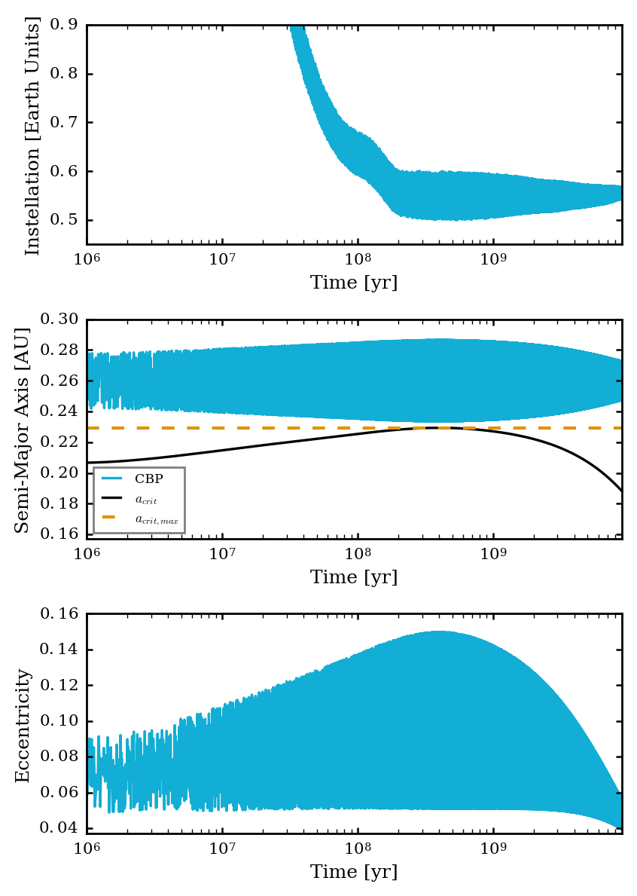

Orbital Evolution of a Fictional Habitable Circumbinary Planet.
=====

Overview
-----

Using the semi-analytic
`Leung & Lee (2013) <https://ui.adsabs.harvard.edu/abs/2013ApJ...763..107L/abstract>`_
model, we show the non-keplerian orbital evolution of a fictional circumbinary planet in close
proximity to the critical semi-major axis of the binary star system with radius of gyration
evolution turned on. In this case, the circumbinary planet is assumed to be in the habitable zone.

===================   ============
**Date**              12/15/19
**Author**            David Graham
**Modules**           binary eqtide stellar
**Approx. runtime**   2 hours
===================   ============
 
Running the script.
----

.. code-block:: bash

    vplanet vpl.in
    python makeplot.py <pdf | png>

Expected image
-----

   Insolation and the orbital evolution the circumbinary planet. The parameters of the binary stars
   and the circumbinary planet were adjusted so that the circumbinary planet can achieve the highest
   and the most variable amplitudes in its semi-major axis and eccentricity. There are three important
   traits for the circumbinary planet to achieve these variabilities in dynamics: varying stellar masses, smallest
   difference between the circumbinary planet's minimum semi-major axis and the binary stars'
   maximum critical semi-major axis, and a very small initial eccentricity for the circumbinary planet.

