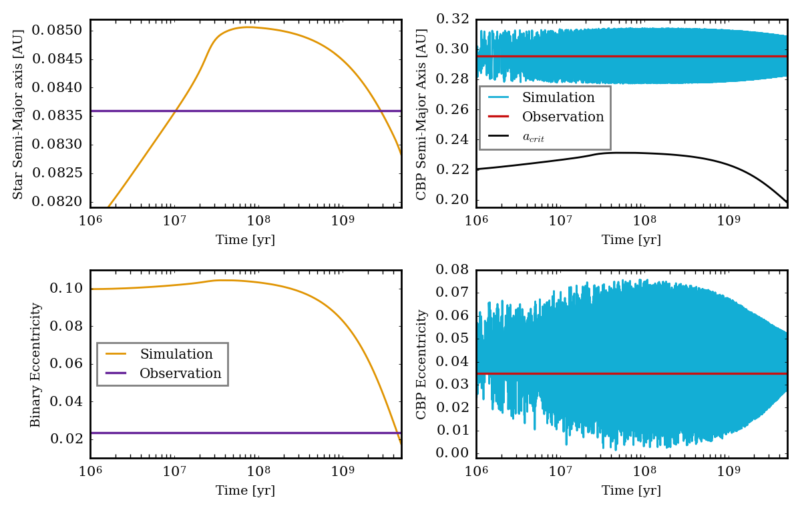

Long-term Time Evolution on the Dynamics of Kepler-47 b. 
=====

Overview
-----

Using the semi-analytic 
`Leung & Lee (2013) <https://ui.adsabs.harvard.edu/abs/2013ApJ...763..107L/abstract>`_
model, we show the non-keplerian orbital evolution of Kepler-47 b, a circumbinary planet in close
proximity to the critical semi-major axis of the binary star system with radius of gyration
evolution turned on.

===================   ============
**Date**              12/15/19
**Author**            David Graham
**Modules**           binary eqtide stellar
**Approx. runtime**   90 minutes
===================   ============ 
 
Running the script.
----

.. code-block:: bash

    vplanet vpl.in
    python makeplot.py <pdf | png>

Expected image
-----

   Orbital evolution of Kepler-47 B and Kepler-47 b. In each plot we compare the simulated values to their 
   present day observed values. We can also see how the critical semi-major axis affects raises the amplitude
   of the circumbinary planet's semi-major axis and eccentricity as the planet approaches the dynamic stability
   limit.
